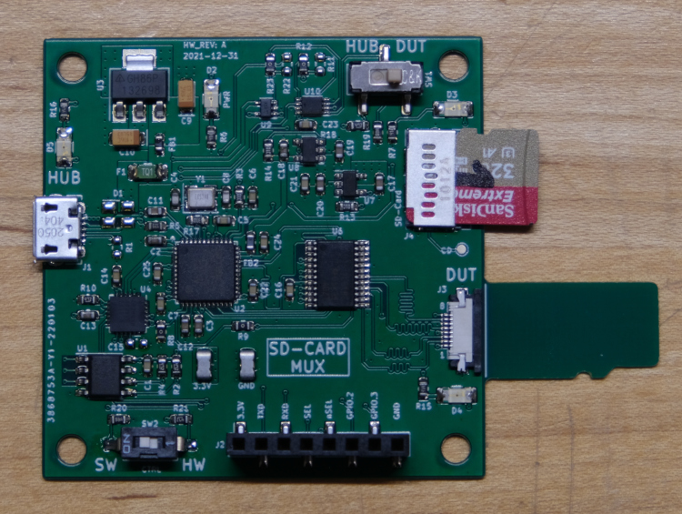
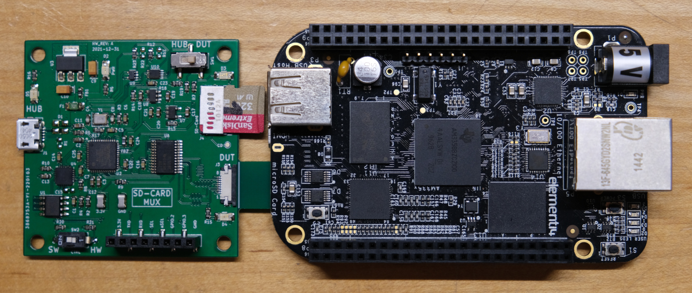

# SD-Card-Mux
A tool to automate testing SD-Card images on embedded devices.



When developing images for embedded devices, do you often find yourself 
constanly moving the SD-Card between the embedded device and development
computer? Surely there is a way to automate this switching...

The SD-Card Mux sits between the host development computer and an
embedded device, such as a Raspberry Pie, and allows an SD-Card to be 
programatically switched between the two.


The board uses a USB hub (U2640) that contains and SD-Card/MMC interface. A
standard micro-SD Card connects to this interface. One of the other USB ports 
connects to a USB-UART bridge (CP2102N). This bridge prodives a UART 
interface to the DUT and also controls the switching on the mux (TS3A27518E) 
using the GPIO on the brdige. The GPIO is controlled by the host computer 
using ```libgpio```. 

Normally, the SD-Card is connected to the host computer. An image that is to be
booted by the DUT is written to the SD-Card. Instead of manually removing the 
card and inserting it into the DUT, a simple script can be added to the 
software development tooling to switch the card from the host computer to the 
embedded DUT.

## Usage
The SD-Card-Mux switching can be either controlled via software or manually
using the switch on the top of the board.



### Software Control
Prerequisite: ```libgpiod```

Ubuntu:
```
sudo apt install libgpiod libgpio-dev
```

Arch: Install from the AUR: 
```
https://aur.archlinux.org/packages/libgpiod/
```

1. Set SW2 (bottom left corner) is set to 'HW'. (**Note:** Silkscreen labels
on the board are backwards)
2. Insert a micro-sd card into J4.
3. Insert the mux board into the micro-sd card slot of the development board.
4. Connect a micro-USB cable between the mux board and development PC.
5. On power-up the mux board will route the SD card to the DUT, as denoted by the
illuminated LED by the micro-sd protrusion.
6. To switch the SD card to the development PC, 
	
	6a. Find the GPIO controller name of the CP210N:
	```
	$ sudo gpiodetect
	gpiochip0 [INT34BB:00] (312 lines)
	gpiochip1 [cp210x] (4 lines)
	```
	6b. The mux control line is on ```GPIO.0```. To switch,
	```
	$ sudo gpioset gpiochip1 0=0
	```
	The LED next to the micro-sd card slot will blink when the SD-Card is
	accessed.

#### UART and Additional GPIO
The SD-Card-Mux can also contains a USB-UART serial bridge. Conect the ```TXD```
and ```RXD``` signals in J2 to thee UART on the DUT. The bridge should appear
on the development computer as ```/dev/ttyUSB0```.

There are also two additional GPIO from the CP210N broken out into the J2 
header (```GPIO.2```, ```GPIO.3```). These signals can be controlled in the same
fashion as the mux switch function using ```gpioset```. One of these lines can
be connected to the reset of the DUT. Ideally, the DUT should be held in reset
while the SD-card is switch. Once switched over, the reset line can be released
allowing the DUT to boot the new image. 

### Manual Control
1. Set SW2 to the 'SW' position. (**Note:** Silkscreen labels on the board are
backwards)
2. Use SW1 to switch the micro-SD card between the DUT and development 
computer. (**Note:** the silkscreen labels are also backwards here).

# Acknowledgements
- https://wiki.tizen.org/SDWire
- https://github.com/kopasiak/sd-mux
